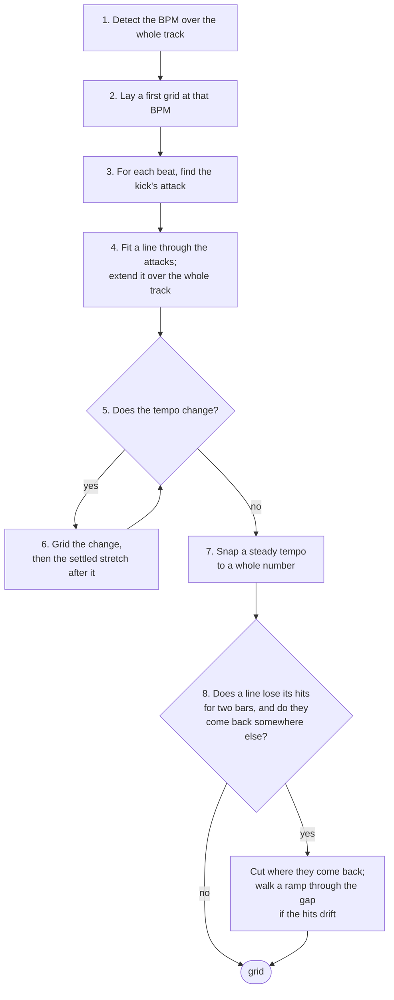

# Beat grid

[Analysis documentation](../README.md) · [Code map](../development.md)

`onset.rs`, `attack.rs`, and `tempo.rs` turn onset envelopes and optional
attack evidence into a `TempoResult`: fitted segments and an explicit beat
list. This stage does not choose the final musical downbeat; `lib.rs` applies
bar-phase selection and numbering afterwards.

Read [Pipeline](../pipeline.md) for stage order and [Assumptions](../assumptions.md)
for the 4/4, tempo, and transition rules. The sections below explain each
part of detection, fitting, and segmentation.

## 1. Detect the BPM

The track is reduced to an **onset envelope**: one number every 256
samples (5.8 ms at 44.1 kHz) saying how much a percussive hit happened
then. It is spectral flux — a 1024-sample window every 256 samples, and
for each window the sum of how much every frequency bin *rose* since the
last one. Rises only, so held notes and decays add nothing and a kick,
which raises many bins at once, adds a lot. A local average is subtracted,
the result is clipped at zero, and the whole envelope is scaled to a peak
of 1. Each value is stamped with the time at the centre of its window.

Two measurements of the envelope are combined, over the whole track:

- **Autocorrelation** — at which lags the envelope lines up with itself.
  Peaks at the beat period and its multiples, and also at one and a half
  beats (kick, hat, kick, hat).
- **Fourier magnitude** — how strong the rhythm is at one exact rate, in
  20-second windows averaged. Strong at the beat rate and its multiples,
  never at two thirds of it. This is what rules out the one-and-a-half
  error.

Every autocorrelation peak within the requested BPM range (70–180 by default) is a candidate, with its
simple multiples and fractions. Each is scored
`autocorrelation × √fourier × prior`, the prior a broad bell centred on
132 BPM that only breaks ties between octaves. Drum & bass comes back at
174, not 87: the faster octave wins when it carries the rhythm.

The whole track is used, not an excerpt, so a tempo change anywhere is
seen (step 5).

## 2. First grid

The winning BPM is refined to a fraction of an envelope sample with a comb
(the envelope summed at every beat of a trial period, at the best of 32
phases), and the phase is the one of 64 that collects the most onset
energy. This grid is only as accurate as the envelope, ±3 ms; it says
where to look for each kick.

## 3. The kick's attack

Beat 1 is always on the kick, and the grid goes on the kick's *attack*.
The attack is the start of an RMS spike in the 900–9000 Hz band — the
click at the front of a kick, which the kick's body (below 200 Hz) and the
bass line do not have.

For each beat of the first grid:

- band-pass the audio to 900–9000 Hz (done once for the whole track);
- take the RMS in 1 ms steps, 15 ms either side of the beat;
- the spike is the strong rise nearest the beat — at least half as steep
  as the steepest in the window; the attack is placed at the midpoint of
  the bin before the rise, avoiding a systematic half-millisecond early bias.

Nearest rather than steepest: the steepest rise in the window lets a grid
drift, because once a beat's prediction slips late the window reaches a
sharper hit further on and the line follows it. A beat with no spike near
it (a breakdown, a beatless intro) is left unplaced and does not pull the
line in step 4.

The line is fitted twice, from the comb's phase and from half a beat
later, and the one that collects more kick is kept. The phrase-structure
stage ([Downbeat](downbeat.md)) still has the last word on which half
of the beat the kicks are on: it is right on 153 of the 155 reference
grids where the kick alone is right on 150, the kick's misses being
off-beat claps with a sharper transient than the kick.

## 4. Fit and extend

A straight line is fitted through the placed beats (time against beat
index), weighted by each spike's height, twice: the second time without
the fifth of beats furthest from the first line and never with any beat
over a tenth of a period off it. Six hundred sample-accurate points fix
the period to well under 0.01 BPM. The line is extended back to the start
of the file — the first beat is the first grid position at or after time
zero, as rekordbox does — and forward to the end.

## 5. Does the tempo change?

The tempo is measured again in 16-second windows over the whole track, by
autocorrelation of each window alone, with a parabola refining the peak
between lag bins. Octave folding stays inside the requested BPM range
(70–180 in the app), so 128 measured against 174 cannot turn into 256. A
window where the track's tempo still fits at 60 % of the best peak has not
changed. A second tempo is believed when at least three windows agree
within 1% of that candidate, it differs by more than 2%, and it is not
within 1% of a ratio a rhythm makes on its own (3⁄2, 2⁄3, 4⁄3, 3⁄4).
The former 3% rhythm exclusion incorrectly swallowed 128→174. Tight
clustering also stops drifting rhythmic aliases from becoming a new tempo. Runs of fewer than three settled windows are
absorbed into their neighbours. The stretches where each tempo is
*settled* — consecutive windows at one tempo — are the anchors for step 6.

## 6. Grid the change

Between two settled tempos there is a stretch where the tempo is moving,
or where the old track's beat has stopped and the new one is coming in.
Both are gridded from the last settled window at the old tempo forward.

**A gradual change** is walked beat by beat: each next beat is looked for
where the last period puts it, the period allowed to drift up to 5 % a
beat. Every measured interval becomes its own segment; averaging four
intervals into a bar would move its interior markers off a curved ramp.
The walk finishes after four consecutive intervals agree with the final
period within 1% and land within 2 ms of its fitted phase. The settled
fit supplies the phase afterwards, avoiding propagation of a single
attack's quantization error. Each beat carries its interval BPM, and the
beat count carries on 1–4 across every cut.

When a transition has no kick to follow and the click detector cannot
place a hit, the walker exaggerates full-band transient rises by 4×,
with an exponential 20 ms release. This gives quiet percussion a chance
to carry the beat through the change. Only actual peaks above the hit
floor count; a held sound or release tail cannot supply another beat.
The emphasis selects the hit, while the original envelope supplies its
timestamp. Clear kick attacks retain their finer timing.

The tuning is in `tempo.rs::TransitionTransients`:

| Setting | Value | Meaning |
|---|---|---|
| `TRANSIENT_GAIN` | 4 | Multiplier on each positive full-band flux rise |
| `TRANSIENT_RELEASE_SECS` | 0.020 s | Exponential release time constant, measured at the envelope rate |
| `KICK_PRESENT` | 0.15 | A kick-band peak at or above this keeps the ordinary timing path |
| `HIT_FLOOR` | 0.02 | Minimum emphasised local maximum accepted as a fallback hit |

The shaper reads the transition plus one second of context on each side.
`walk_report` uses the same fallback as the production transition walker.
The separate same-tempo gap walker in §8 keeps its existing envelope and
thresholds. The private fixture guide (`rbxport-private/crates/rbl-analysis/docs/grid-fixtures.md`, “Transitions without kicks”)
lists the quiet-transition, release, silence and timing regressions.

**A jump, or a change with no reliable transients to follow, is one cut.** In a DJ edit
the next track comes in under the last one's breakdown bars before it
drops — an impact on a downbeat, an arp in eighths, claps on two and four,
a snare roll into the drop, its own kick at half level — and a hand grid
holds the old tempo until the kick states the new one at full level. So
the kick is read on every beat of the new grid, from the old tempo's last
settled window to the end of the new tempo's settled stretch: the kick
band (spectral flux under 200 Hz, from the audio low-passed and decimated
by 32, scaled so its strong hits read as one) where the stretch has one,
the click attack where it does not. Its runs — stretches of bars that read
it — are found at its gaps, and a run weaker than 0.55 of the strongest,
or shorter than two bars, is not the beat yet: an incoming kick pattern
under a breakdown sits at about half of its eventual level, and a kick
returning after a breakdown at about 0.6 of the level it reaches a minute
later. The cut goes in the first bar of the first run that is the beat:
not a fill into the bar after it (twice as much kick), starting on the
beat, carrying the rest of the mix (full-band flux at 0.7 of its settled
level), and read better by the new grid than by the old one carried on.
Within that bar the cut is the first beat whose kick is half the bar's
strongest, with the mix on it and, where the section's kicks have a
click, with the click: the beat before a drop is a pickup, a kick roll
into a drop is thumps without clicks. Where no run qualifies — the new
tempo's stretch is a breakdown with no kick of its own — the cut goes
where the onsets stop following the old grid and start following the
new, using the same transient emphasis where the kick is absent. The
earliest supported beat wins a tie, so silence before a hit cannot move
the cut earlier. This processing is confined to transitions; whole-track
tempo estimation and settled-grid fitting use the original envelopes.

A new segment starts with the beat it was cut on. An old-tempo beat within
half a period before the cut is the same hit as the new tempo's first
beat and is dropped.

[Multi-tempo evaluation](../validation/multitempo.md) records a baseline from before transient emphasis:
seven of ten changes were within 3 ms, and the three misses were where the hand
grid switched at the impact that ends a section, with the new tempo's
kick arriving twenty seconds later.

## 7. A whole number

A steady tempo within 0.1 BPM of a whole number may be that whole number:
the line is fixed at that period and re-phased through the same kicks, so
it turns about their centre. Dance music is produced at whole tempos, every
reference track is at one, and the fit lands within 0.05 of it on all of
them. The beats of a walked change keep their measured interval tempo.

The whole number is taken only when its line sits on at least 85 % as much
of the music as the measured line (`on_line`: each beat's hit by strength,
counted in full on the line and less the further it is, to nothing at
10 ms). A track that really runs a few hundredths off a whole number keeps
its measured tempo, because the whole number's line drifts off its hits
bar by bar. Rekordbox does not round either: its Normal analysis searches
the tempo in 0.002 BPM steps around its estimate
(`BeatAnalyzer_1_0::UnitBeatAdjust::bpmAdjust` in rekordbox 7 for macOS),
and 13,894 of 35,262 grids in one rekordbox library start at a tempo that
is not a whole number, drum & bass at 173.97 to 174.01 among them.
Rounding 173.97 to 174 puts a grid 52 ms early by the end of five minutes.
The 85 % allows for a fit pulled a few hundredths off by a second,
half-level kick pattern: the reference edit `Bring Me Back to Life
[138-150]` fits its 138 section at 137.96, and the 138 line sits on 88 %
as many of its hits.

## 8. Gaps

A line fitted through a stretch is only right where its hits are on it.
After the segments are fitted (`split_gaps`), each line is checked beat by
beat for a hit — a peak of the onset envelope within a tenth of a beat.
Two bars or more without one is a gap, and what comes after the gap
decides what happens to it:

- **The line resumes on its own grid** (two bars of hits on it again): it
  holds across the gap, whatever the breakdown did, as hand grids hold.
  Nothing changes.
- **The music comes back at the same tempo on another phase.** The
  stretches before and after the gap are fitted on their own, and each is
  put on its kicks by the kick band's own onset envelope (the attack
  judge inside the fit is wrong on one stretch in thirty, and two halves
  it put on different halves of the beat would read as a phase change).
  When both halves say where their kicks are, their lines differ by more
  than a tenth of a beat, and the new line collects half again as much
  kick after the gap as the old one carried on, the grid cuts: at the
  first bar of hits on the new line, the old line dropping its beat
  within half a beat of the cut. A stretch after the gap shorter than 64
  beats — an outro's last bars — is never believed to have a phase of its
  own.
- **The hits through the gap drift** — an eighth-note bass under a
  tape-stop, slowing bar after bar with no kick to follow. From the last
  supported beat before the gap the hits are walked on the full-band
  envelope: each next beat is looked for from three quarters of the last
  period to five quarters of where the last two periods put it (the
  eighth note between two beats stays outside that window), the strongest
  peak for its distance from the prediction wins, a hit must be a quarter
  of the mean of the last four, and the period may change by up to 30 %
  a beat. Eight beats going one way, with the period at least 5 % from
  the line's, are a ramp, and each walked beat becomes a segment of its
  own length, up to the cut; the stretch from the last walked beat to the
  cut is whole beats at the pace the ramp was going. A ramp is only
  gridded where it leads somewhere: through a gap whose line comes back
  on its own grid it is a breakdown, and the line holds.

The reference case is `BATTERY OPERATED`: 130 BPM to bar 65, then the
kick stops and the bass slows from an eighth of 231 ms to one of 1.4 s,
silence, and 130 again from 2:27.0 on a phase 208 ms from the old line's.
The grid holds to bar 65, follows the bass beat by beat down to 22 BPM,
and cuts at 147.029 s, where the hand grid re-phases.

## Output

`TempoResult`:

- `bpm` — the tempo the track starts at, which is what a library shows.
- `segments` — one per tempo: where it starts and ends, the period, and
  any beat's time. A walked transition is a run of one-beat segments;
  a walked ramp a run of one-beat segments.
- `beats` — every beat's time in ms, its tempo ×100, and its number in the
  bar. Numbering here is 1–4 from the first beat; [Downbeat](downbeat.md)
  fixes it on the first tempo's music, and the count carries on across
  every change as rekordbox numbers a hand grid.
- `confidence` — how far the winning tempo stood above the best candidate
  that is not a simple ratio of it.

## Changing this stage

Follow the [change workflow](../development.md#make-a-change) and run the
[relevant public checks](../validation/README.md#public-tests). Preserve the
input/output contract above and update the reference when options or evidence
change. Report new measurements separately from the recorded results.
