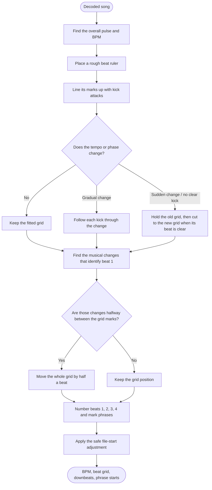
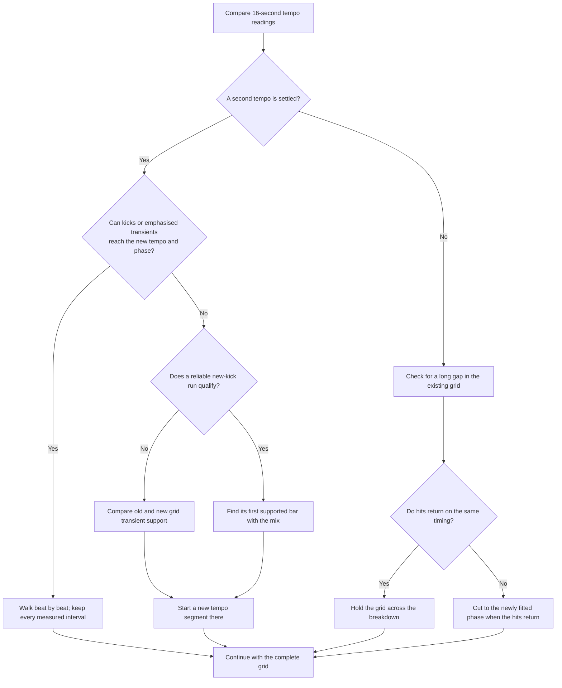
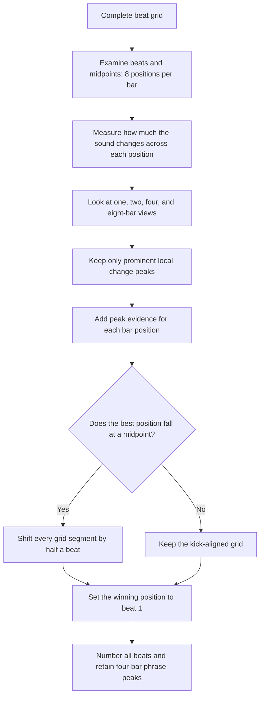

# How rbxport finds a song's beat grid

[Analysis guide](../README.md) · [Documentation](../../../docs/README.md)

Start here for the beat algorithm, then use the individual stage documents for implementation detail.

This overview introduces the beat-analysis algorithm. Read it before the
[API/code map](development.md), [pipeline](pipeline.md), and individual stage
references in the [documentation index](README.md).

Given a decoded song, the algorithm puts a reliable timestamp on every
beat, identifies beat 1 of each bar, and keeps that grid useful through
breakdowns, edits, and tempo changes. rbxport assumes the song is in 4/4, so
each bar has four beats. It follows the kick drum for timing, but uses larger
musical changes to decide where a bar begins.

The result includes the displayed BPM, a list of timed beats, a beat number
(1–4) for each one, and tempo segments for any changes in the song. The same
audio always produces the same result.

The app opens [Analysis Setting](../../../docs/user/analysis-settings.md) before
manual analysis. BPM/grid and key can be selected independently, with
high-precision placement and a BPM range for the grid. Unchecked results
are preserved. The algorithm below describes BPM/grid analysis with
high precision enabled.

## Analysis rules

rbxport applies the following rules for electronic dance music:

- **Four beats per bar.** Every analysed track is in 4/4. A bar has four
  beats, numbered 1–4, and beat 1 is the downbeat.
- **Whole-number steady tempos.** A fitted steady tempo within 0.1 BPM of a
  whole number is set to that number when the whole number's grid sits on
  the music nearly as well as the measured one; a track that really runs at 173.97
  keeps 173.97. Gradual changes retain their measured
  tempo from beat to beat.
- **Fast drum & bass.** Drum & bass is counted at the fast tempo, such as
  174 BPM rather than 87, when the faster octave carries the rhythm.
- **Kicks establish tempo.** The grid is placed where kick drums reliably
  state the tempo. A half-level kick, isolated impact, eighth-note arp,
  claps on beats two and four, or snare roll does not establish a new tempo
  by itself.
- **Quiet transients can carry a transition.** When no usable kick or click
  places the next beat, emphasise full-band transient rises with 4× gain
  and a short, 20 ms release. Keep their original timing and require actual
  peaks; silence and release tails cannot supply beats.
- **Cuts need support.** When a transition cannot be walked, prefer the
  new tempo's reliable kick run with the rest of the mix. If no run
  qualifies, compare transient support on the old and new grids and cut
  on a supported beat of the new grid.
- **Gradual changes preserve each beat.** A gradual change between settled
  tempos retains each measured interval, including through a curved ramp.
  The beat count continues through the change.
- **Phase changes create cuts.** If music returns at the same tempo but on a
  different timing phase, the grid cuts at the first bar of reliable hits on
  the new phase. If it returns on the original timing, the grid holds through
  the gap.
- **Ramps must lead somewhere.** A lost tempo that audibly slows or speeds up
  is followed beat by beat only when it leads to a new timing phase; otherwise
  the gap remains a breakdown.
- **Structure identifies beat 1.** Beat 1 is determined from structural
  changes in the arrangement, including drops, breakdowns, new bass lines,
  and phrase starts. Beat 1 is on the kick, never on an off-beat.

## Overview

rbxport first finds the song's regular pulse and aligns it with the front
edge of the kick drums. It then checks whether the tempo or timing phase
changes, and identifies beat 1 from large changes in the arrangement.

## 1. Hear the pulse and choose the BPM

The algorithm turns the song into a compact timeline of **new-hit strength**.
It is high where percussion begins and low while a sound is merely holding or
fading. It then asks two related questions across the entire track: “how
often does this pattern repeat?” and “how much energy does it have at each
possible speed?” The best-supported answer between 70 and 200 BPM becomes
the starting tempo.

This combination prevents common counting mistakes. For example, drum & bass
is reported as 174 BPM rather than half-time 87 BPM when the faster rate is
the one carrying the rhythm. A broad preference around 132 BPM only settles
otherwise-close octave ties; it does not force songs toward 132.

> **Technical deep dive — onset envelope and tempo score**
>
> The onset envelope is spectral flux: a 1,024-sample spectrum is measured
> every 256 samples (about 5.8 ms at 44.1 kHz), and only positive increases
> in frequency-bin energy are summed. A local average is removed, negative
> values are clipped, and the envelope is normalised to a peak of one. Each
> point is timed at its window centre.
>
> Candidates come from autocorrelation peaks between 70 and 200 BPM plus
> their simple multiples and fractions. They are scored as
> `autocorrelation × √fourier × prior`. Autocorrelation finds repeating
> spacing but can favour a 1½-beat pattern; the averaged 20-second Fourier
> magnitude measures exact rhythmic rates and rejects that ambiguity.

## 2. Make a rough grid, then put it on the kick

Knowing the BPM says how far apart the beats are, but not exactly where the
first one falls. rbxport tries many possible starting positions and selects
the one that lands on the most rhythmic energy. That gives a useful but
coarse ruler.

It next looks close to every predicted beat for the kick's **attack**: the
very beginning of the kick, rather than its low, boomy body. Missing kicks
in intros and breakdowns are allowed; they do not drag the ruler away from
the parts where the timing is clear. A straight line through the reliable
attacks creates the steady grid, which is extended across the whole file.

> **Technical deep dive — precision placement**
>
> A comb refines the period to a fractional onset-envelope sample and tests
> 32 phases; a 64-phase search supplies the initial phase. For kick placement,
> the complete track is band-passed to 900–9,000 Hz. RMS is measured in 1 ms
> steps within ±15 ms of a predicted beat. The selected attack is the start
> of a strong rise nearest the prediction, at least half as steep as the
> strongest rise in that window. Choosing the nearest qualifying rise avoids
> a grid slowly chasing a sharper transient later in the window.
>
> The timing line is weighted by attack height, fitted twice, and the fifth
> of points furthest from the first fit are removed. No point more than one
> tenth of a beat from the line survives the refit. rbxport also fits the
> alternate half-beat phase and keeps the one that collects more kick energy.
> If a steady result is within 0.1 BPM of a whole number, and the whole
> number's line sits on at least 85 % as much of the music, it snaps to that
> number and is re-phased through the same kicks.

## 3. Deal with tempo changes, breakdowns, and re-phasing

The Normal analysis mode skips this step: like rekordbox's Normal analysis,
it keeps one constant grid, fitted over the whole track. The RBXport mode
does the following.

A grid is not assumed to be correct forever just because it works at the
start. rbxport checks 16-second slices throughout the song. A new tempo must
show up consistently in at least three slices, differ by more than 2%, and
not be within 1% of a familiar musical ratio such as 3:2. Those three
slices must agree within 1% of the candidate. Local tempo peaks are
interpolated, and octave folding stays inside the requested BPM range.
Short-lived readings are folded
into their neighbours.

Between two settled tempos, rbxport walks from the old tempo toward the
new one, preferring kick attacks. It can adjust each beat a little and makes
a separate tempo segment for each measured interval. This allows a non-linear rise or fall to
follow the music rather than assuming a perfectly smooth ramp.

When neither a kick nor a usable click places a beat, rbxport exaggerates
the remaining full-band transient rises with 4× gain and a 20 ms release.
Quiet percussion can then carry the walk through the change. The shaped
envelope selects the hit; its original timestamp keeps the release from
shifting the grid. A held sound, release tail, or sub-threshold noise does
not count as another beat.

If the walk cannot reach the new tempo and phase, rbxport places a cut.
It first looks for a reliable new kick run with the rest of the mix. If
none qualifies, the same transient emphasis helps compare the old and new
grids. The cut goes where their support changes sides, with ties going
to the earliest supported new beat rather than an empty beat before it.

There are two special cases inside a long gap:

- If the music returns on the same timing, the grid remains intact across
  the breakdown.
- If it returns at the same BPM but shifted in time, the grid cuts to the
  new phase at the first bar of reliable returning hits. If the remaining
  hits slow or speed up toward that cut, rbxport can follow them beat by
  beat instead of pretending they are constant tempo.

The 1–4 beat count normally continues through a tempo cut. An old beat very
near the new segment's first beat represents the same musical hit and is
removed from the old segment.

> **Technical deep dive — deciding where a cut belongs**
>
> In a gradual transition, the next beat is sought near the previous period,
> with up to 5% period drift per beat; each interval becomes a segment.
> Four consecutive intervals must agree with the final tempo within 1%
> and its fitted grid within 2 ms before the steady fit resumes.
>
> `TransitionTransients` derives a separate envelope over the transition
> and one second of context either side. At envelope rate `r`, each value
> is `max(4 × max(flux[n] − flux[n−1], 0), previous × exp(−1/(r × 0.020)))`.
> This uses a 20 ms exponential time constant. Only local maxima at least
> 0.02 high qualify; the original flux peak supplies their timestamp.
> A kick-band peak of at least 0.15 keeps the ordinary kick path, and a
> usable click also retains priority during the walk. Full-band fallback
> searches within one tenth of a beat. Whole-track BPM estimation and
> settled fits use the original envelopes.
>
> In an unclear transition, low-frequency spectral flux (below 200 Hz,
> decimated by 32) and the high-frequency attack detector are evaluated on
> both candidate grids. A qualifying new run is at least two bars and not
> weaker than 0.55 of the strongest run. Its first cut bar must favour the
> new grid, have a full-band mix at roughly 0.7 of settled level, and begin
> with a kick at least half the bar's strongest one. This keeps fills,
> pickups, and half-level incoming drums from being mistaken for the new
> tempo.
>
> If no run qualifies, full-band evidence is replaced with the emphasised
> transient evidence at beats whose kick is below 0.15. Score each supported
> new-grid cut by old-grid support before it plus new-grid support from it
> onward; an empty beat is not a candidate. `walk_report` uses the same
> fallback as the transition walker.
>
> A drifting gap is walked on the full-band envelope. A candidate hit must
> be at least one quarter of the recent mean; periods may change up to 30%
> per beat. Eight consistently drifting beats at least 5% from the original
> line form a ramp. A ramp is kept only when it leads to a real phase cut.

## 4. Decide which beat is “1”

Kicks alone cannot always distinguish the real beat from an off-beat clap,
hat, or reverse bass. rbxport instead listens for **structure**: drops,
breakdowns, new bass lines, and other changes in the arrangement. In dance
music, those changes usually arrive on the first beat of a bar and often on
larger phrase boundaries.

It examines both each grid beat and the midpoint between beats, giving eight
possible positions in a bar. The position that repeatedly coincides with
the biggest musical changes wins. If the winner is a midpoint, the existing
grid is on the off-beat and every tempo segment is moved by half a beat.
The winning position becomes beat 1; the rest are numbered 2, 3, and 4.

When the first tempo segment has at least 32 beats, its own music decides
its bar position, so a longer later section cannot outvote the opening.
The chosen count carries through every later cut and ramp interval.
Repeated beats without meaningful four-bar spectral change retain the
first-beat fallback instead of treating FFT alignment noise as structure.

> **Technical deep dive — structural novelty**
>
> Every half beat receives a 12-band, mean log-energy profile from 40 Hz to
> 10 kHz. It uses a 2,048-sample spectrum every 512 samples and averages the
> spectra over that half beat. At each position, novelty is the distance
> between average profiles before and after it, measured at one-, two-,
> four-, and eight-bar scales. Only local maxima count, and each scale's
> peaks are normalised to sum to one before their evidence is added by bar
> position. This prevents a slow crescendo from voting almost equally for
> every position, and prevents long phrases from drowning out bar-scale
> changes.

## 5. Handle the beginning of the file carefully

Most grids are extended backward from the music, so a perfectly valid beat
can land just before time zero and leave the first visible beat almost a
full beat later. If audio starts immediately, the grid is aligned very near
zero, and the downbeat decision agrees, rbxport anchors beat 1.1 at exactly
`0:00.00`.

For a file that begins less than 20 ms into its opening beat, only the
missing opening beat is added at zero. All later timestamps and BPM values
stay exactly as fitted, so the first interval is briefly shorter. Files with
silence at the start, a clearly later musical downbeat, or a cut of 20 ms or
more keep their original grid.

> **Technical deep dive — boundary gate**
>
> The first segment must begin within 15 ms of zero and have either a
> boundary beat within 15 ms or a computed opening cut strictly below 20 ms.
> Full-band peak energy must appear in the first 15 ms, with the first
> millisecond at least 10% of that local peak. The inferred opening beat must
> agree with the downbeat cycle. For an isolated attack after silence, the
> cut estimate is refined at sample precision; otherwise the fitted position
> is used. This is a boundary heuristic, not proof of song structure.

## Testing with real tracks

rbxport is tested against real electronic tracks whose rekordbox grids were
checked or set by hand.

| Test material | Count | Coverage |
|---|---:|---|
| Purchased Beatport tracks | 155 | <ul><li>All are 4/4; 100% are 123–178 BPM.</li><li>Genre tags: tech house, melodic house and techno, drum & bass, indie dance, mainstage, peak-time techno, dance and electro-pop, hard dance, trance, house, and progressive house.</li><li>95 tracks have no genre tag.</li><li>Includes beatless intros, breakdowns, drops, off-beat percussion, and varied kick and bass patterns.</li></ul> |
| Custom DJ edits | 9 | <ul><li>Abrupt cuts</li><li>Gradual rises and falls</li><li>Return to an earlier tempo</li><li>Constant-tempo control track</li><li>Slowdown followed by a re-phased return</li></ul> |

| Measurement | Pass condition | Result passing |
|---|---|---:|
| BPM, purchased tracks | Within 0.05 BPM | 100% |
| Downbeat, purchased tracks | Within 25 ms, modulo one bar | 92.3% |
| Full grid, purchased tracks | At least 98% of beats within 25 ms with the same number | 91.6% |
| BPM, custom DJ edits | Correct BPM | 100% |
| Tempo changes, custom DJ edits | Within 3 ms of the hand grid | 70% |

Eleven purchased tracks retain a rekordbox 6 grid about 25 ms after the
kick. On the 142 tracks analysed by rekordbox 7, rbxport passes BPM on all
142, downbeat on 141, and full grid on all 142. The three remaining DJ-edit
differences switch at an earlier impact, before a settled new-tempo kick
pattern arrives.
